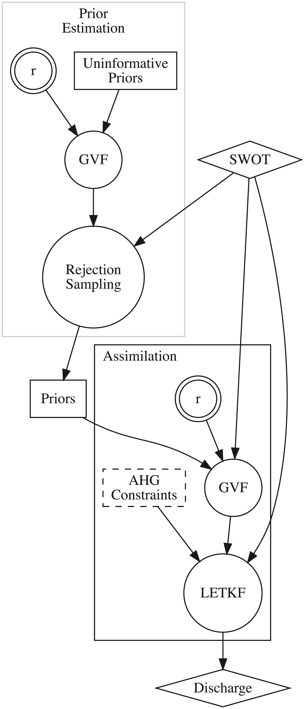

# Algorithm

The SAD algorithm operates on the set of SWOT observables (i.e., WSE, width, and slope) and derives an estimate of river discharge and its associated uncertainty using a data assimilation scheme. The assimilation scheme involves the "first-guess" estimation of hydraulic variables by combining a forward model with a set of prior probability distributions before assimilating the SWOT observations. The priors are either acquired from the [SWORD](https://zenodo.org/record/3898570) a-priori database or are derived using a data-driven approach (rejection sampling).

```@raw html

```

## Hydraulic model

The forward model in the assimilation scheme is based on the Gradually Varied Flow (GVF) equations, which describe the steady-state, non-uniform flow in river channels with gradual variations in water depth and velocity. The general form of the GVF equation is 

```math
\dfrac{dY}{dx} = \dfrac{S_0 - S_f}{1 - \text{Fr}^2}
```

where Y is the average water depth, x is the longitudinal distance, S0 is the channel bed slope, Sf is the water surface slope, and Fr is the Froude number. 

## Cross sections

## Data assimilation
