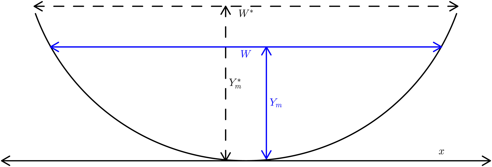

# Algorithm

SAD v2 estimates river discharge from SWOT observations (water surface elevation,
width, and slope) using **joint MAP (Maximum A Posteriori) estimation** with an
**analytical forward model**. This section describes the forward model, the
inference framework, and the data processing pipeline.

## Overview

The core idea of SAD v2 is to estimate all unknown parameters — discharge Q
at each timestep, Manning roughness n, Dingman channel shape r, and downstream
bed elevation z₀ — **simultaneously** by minimizing a single objective function
(the negative log-joint). This replaces the v1 two-stage LETKF+GVF pipeline,
which suffered from two-stage bias (parameters estimated at mean-Q propagate
systematic bias into Q) and computational cost (O(N × nt) ODE solves).

## Forward model: Manning + first-order GVF perturbation

Under the low-Froude-number regime (Fr² ≈ 0) typical of large low-gradient
rivers observed by SWOT, the gradually varied flow equation linearizes around
uniform flow to produce an exponential backwater decay from the downstream
boundary condition. This yields a **fully analytical** WSE profile with no ODE
solve, making it both fast and AD-compatible.

### Manning equation with Dingman cross-section



The Dingman power-law cross-section parameterizes channel shape with a single
exponent r (1 < r < ∞):

```math
A = W_b \left(\frac{r+1}{r \cdot Y_b}\right)^{1/r} y^{1+1/r}
```

```math
W = W_b \left(\frac{y}{Y_b}\right)^{1/r}
```

where ``y`` is mean flow depth, ``W_b`` is bankfull width, ``Y_b`` is bankfull
mean depth, and ``r`` is the Dingman shape exponent (``r = 1`` for triangular,
``r \to \infty`` for rectangular).

Under the wide-channel approximation (``R \approx y``), Manning's equation becomes:

```math
Q = \frac{1}{n} W_b \left(\frac{r+1}{r \cdot Y_b}\right)^{1/r} y^{5/3 + 1/r} S^{1/2}
```

This can be analytically inverted for depth:

```math
y_0 = \left(\frac{Q \cdot n}{W_b \left(\frac{r+1}{r \cdot Y_b}\right)^{1/r} \sqrt{S}}\right)^{1/(5/3 + 1/r)}
```

### First-order GVF perturbation

Linearizing the friction slope around uniform flow with the Dingman geometry:

```math
\frac{\partial S_f}{\partial y}\bigg|_{y_0} = -\left(\frac{10}{3} + \frac{2}{r}\right) \frac{S_0}{y_0}
```

In the low-Froude-number limit, the GVF equation yields an exponential decay:

```math
\lambda = \frac{3\,y_0\,r}{(10\,r + 6)\,S_0}
```

```math
y(x) = y_0 + (y_{bc} - y_0) \,\exp(-x/\lambda)
```

where ``y_{bc} = (H_{bc} - z_0) \cdot r/(r+1)`` is the downstream boundary depth
and ``H_{bc}`` is the observed downstream WSE (a boundary condition, not a data
point in the likelihood).

The WSE at any node is then:

```math
\mathrm{WSE}(x) = z_0 + z_{\mathrm{ref}}(x) + y(x) \cdot \frac{r+1}{r}
```

Key properties:
- **Fully analytical**: no ODE solve, enabling millisecond-per-reach computation
- **AD-compatible**: works with ForwardDiff for gradient and Hessian computation
- **Physically meaningful**: captures M1 (backwater) and M2 (drawdown) profiles
- **Asymptotically correct**: λ ≪ L → uniform flow; λ ≫ L → boundary-controlled

## Inference: Joint MAP + Laplace uncertainty

### Parameter vector

All parameters are estimated in a single optimization:

| Component | Variable | Transform | Index |
|-----------|----------|-----------|-------|
| Discharge | ``\log Q_t`` (t = 1…nt) | Log-space | θ[1:nt] |
| Manning roughness | ``\log n`` | Log-space | θ[nt+1] |
| Dingman shape | ``\log r`` | Log-space | θ[nt+2] |
| Bed elevation | ``z_0`` | Natural space | θ[nt+3] |

Log-space transforms enforce positivity (Q > 0, n > 0, r > 0) and improve
optimization conditioning.

### Objective function

The negative log-joint comprises four terms:

**1. WSE likelihood** (applied at upstream nodes j ≥ 2 only):

```math
\ell_{\mathrm{WSE}} = \sum_{k} \sum_{j \geq 2} \frac{\nu+1}{2} \log\left(1 + \frac{(H_{jk}^{\mathrm{obs}} - \mathrm{WSE}_{jk}^{\mathrm{pred}})^2}{\nu\,\sigma_{\mathrm{obs}}^2}\right)
```

Student-t (``\nu \approx 5``) for robustness to outliers. Gaussian (``\nu \to \infty``) is also supported.

**2. Width likelihood** (optional, activated via `use_width=true`):

```math
\ell_{\mathrm{W}} = \sum_{k} \sum_{j \geq 2} \frac{1}{2}\left(\frac{W_{jk}^{\mathrm{obs}} - W_{jk}^{\mathrm{pred}}}{\sigma_W}\right)^2
```

**3. Parameter priors** (from SoS database):

```math
\ell_{\mathrm{prior}} = -\log p(Q_t \mid \mathrm{month}_t) - \log p(n) - \log p(r) - \log p(z_0)
```

Monthly climatological log-normal priors (``\sigma_{\log Q} = 1.0``) resolve the
n–z₀–Q equifinality. The Manning n prior is truncated Normal(0.03, 0.01, [0.01, 0.05])
as regularisation.

**4. Temporal smoothness** on log-Q:

```math
\ell_{\mathrm{smooth}} = \lambda_{\mathrm{smooth}} \sum_{t=2}^{n_t} \left(\log Q_t - \log Q_{t-1}\right)^2
```

Adaptively reduced for data-sparse reaches (``\lambda_{\mathrm{smooth}} \propto \min(1, f_{\mathrm{data}}/0.1)``
where ``f_{\mathrm{data}}`` is the fraction of valid timesteps).

### Optimization and uncertainty

The objective is minimized via **L-BFGS** with ForwardDiff-computed gradients
and Hessians. Convergence typically requires 50–200 iterations.

Posterior uncertainty is obtained via the **Laplace approximation**: the inverse
Hessian at the MAP estimate gives the posterior covariance matrix ``\Sigma``.
Q uncertainty is computed via the delta method: ``\sigma_Q \approx Q \cdot \sigma_{\log Q}``.

### σ_obs estimation and retry logic

The WSE observation noise ``\sigma_{\mathrm{obs}}`` is auto-estimated from local
residuals in the SWOT observations, with a minimum floor of 0.3 m to account
for model structural error.

If the optimizer converges to **unphysical parameters** (n > 0.10, r > 15,
z₀ far from hmin, or Q spikes > 10× prior median), ``\sigma_{\mathrm{obs}}``
is progressively doubled and optimization is retried. This handles cases where
the auto-estimated noise is too tight for the Manning+Dingman model's structural
error — common for small rivers with very precise SWOT observations.

If after retry the Manning n exceeds the prior truncation (0.05), the algorithm
falls back to a **prior + WSE anomaly** method that uses prior medians for
channel parameters and scales Q by a damped WSE depth anomaly.

## Preprocessing

### SWOT observations to SWOTReach

Raw SWOT observations (WSE, width, slope at irregular node positions) are
interpolated onto a regular computational chainage using PCHIP interpolation:
- **Chainage**: downstream (x = 0) to upstream (x increasing), spacing ``\delta x = 200`` m
- **Bed slope** S₀: time-averaged from SWOT slope observations, floored at ``10^{-5}``
- **Cumulative bed elevation** ``z_{\mathrm{ref}}(x)``: ``z_{\mathrm{ref}}(x_{j+1}) = z_{\mathrm{ref}}(x_j) + S_0(x_j) \cdot \Delta x``
- **Bankfull geometry** (``W_b``, ``Y_b``): median across timesteps, PCHIP-interpolated to chainage
- **Valid timesteps**: those with ≥ 2 valid WSE observations

### B-spline smoothing

Penalized cubic B-splines are available for WSE profile smoothing (via the
`nknots` and `lambda` keyword arguments in `preprocess`). Generalized
Cross-Validation (GCV) can automatically select the smoothing parameter.
B-spline derivatives provide reach-averaged slope and enforce monotonicity.

## Priors

Prior distributions are constructed from the **SWORD of Science (SoS)** database
when available, or from uninformative priors otherwise.

### Discharge priors

When monthly ML discharge estimates are available in SoS, **12 monthly truncated
LogNormal distributions** are constructed:

```math
Q_{\mathrm{month}} \sim \mathrm{TruncatedLogNormal}(\log(Q_m) - \sigma^2/2,\; \sigma{=}1.0,\; q_l,\; 10 \cdot Q_m)
```

where ``Q_m`` is the monthly ML mean and ``\sigma = 1.0`` in log-space gives a
95% CI of approximately ``[0.14 \cdot Q_m, 7.4 \cdot Q_m]``, wide enough to
capture floods and droughts.

When monthly data is unavailable, a single time-invariant truncated LogNormal
is used with the same ``\sigma = 1.0``.

### Static parameter priors

| Parameter | Distribution | Support | Source |
|-----------|--------------|---------|--------|
| Manning n | Truncated Normal(0.03, 0.01) | [0.01, 0.05] | SoS bounds |
| Dingman r | Truncated Normal(μ, σ) or Uniform | Variable | SoS or river class |
| Bed elevation z₀ | Uniform | [hmin − depth − depth, hmin − depth + depth] | Manning depth estimate |

The n prior truncation at 0.05 acts as regularisation — values above 0.05 are
uncommon in natural channels and typically indicate the optimizer is compensating
for model structural error. A subsequent check at n > 0.10 flags genuinely
unphysical solutions.

### z₀ prior estimation

The downstream bed elevation prior is centered on:

```math
z_0 \approx h_{\min} - y_{\mathrm{Manning}}
```

where ``y_{\mathrm{Manning}}`` is the Manning depth estimated from the SoS mean
discharge, a typical n (0.035), and the reach slope. Width for the Manning depth
estimate comes from a Q–W scaling relationship: ``W \approx 5\sqrt{Q}``.