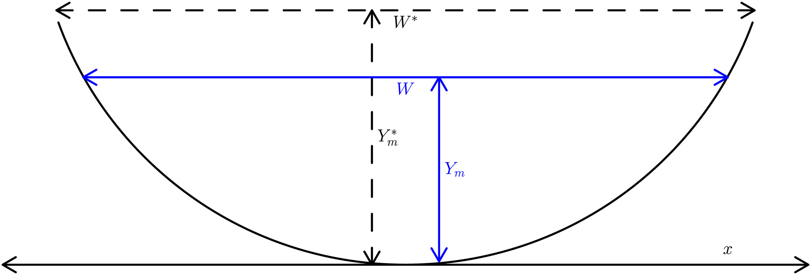

# Algorithm

The SAD algorithm operates on the set of SWOT observables (i.e., WSE, width, and slope) and derives an estimate of river discharge and its associated uncertainty using a data assimilation scheme. The assimilation scheme involves the "first-guess" estimation of hydraulic variables by combining a forward model with a set of prior probability distributions before assimilating the SWOT observations. The priors are either acquired from the [SWORD](https://zenodo.org/record/3898570) a-priori database or are derived using a data-driven approach (rejection sampling).


## Hydraulic model

The forward model in the assimilation scheme is based on the Gradually Varied Flow (GVF) equations, which describe the steady-state, non-uniform flow in river channels with gradual variations in water depth and velocity. The general form of the GVF equation is 

```math
\dfrac{dY}{dx} = \dfrac{S_0 - S_f}{1 - \text{Fr}^2}
```

where Y is the average water depth, x is the longitudinal distance, S0 is the channel bed slope, Sf is the water surface slope, and Fr is the Froude number. The latter is given by

```math
Fr = \dfrac{Q}{WY\sqrt{gY}}
```
where W is the average flow width, Q is river discharge, and g is the gravity acceleration, while the water surface slope can be calculated as a function of discharge, channel geometry, and flow resistance.

Integrating the GVF equations allows for calculation of longitudinal profiles of water surface elevation along a river, and are solved using [DifferentialEquations.jl](https://github.com/SciML/DifferentialEquations.jl). 

## Cross sections

Currently, rectangular and Dingman cross sections have been implemented. The latter allows for a more realistic representation of river channel cross sections and is the default in SAD.



The variables $W^{\ast}$, $W$, $Y_m^{\ast}$, and $Y_m$ are the bankfull width, water surface width, bankfull maximum depth, and maximum depth respectively. These are related to the average width and flow depth via a channel shape parameter $r$

```math
Y = \left( \dfrac{r}{r+1} \right) Y_m
```
```math
W = W^{\ast} \left( \dfrac{Y_m}{Y_m^{\ast}} \right)^{1/r}
```

Hydraulic geometry relations can be incorporated into the SAD GVF model through the relationships between the AHG coefficients and exponents and the channel cross-section geometric variables: 

```math
W = a Q^b
```
```math
Y = c Q^f
```

The r parameter ($0 < r < \infty$) reflects the river channel shape, with r=1 corresponding to a triangular channel. As r increases, the channel banks become steeper, and the bottom becomes flatter leading to a rectangular channel for $r \rightarrow \infty$

## Data assimilation

The assimilation algorithm employed in the implementation of SAD presented here is the Local Ensemble Transform Kalman Filter (LETKF). The LETKF is a variant of the Ensemble Kalman Filter that combines a prior probability distribution of state variables (e.g., river discharge) with direct or indirect observations (in this case, water surface elevation and width) to generate an optimal estimate (i.e., analysis). The prior distribution is represented by the model error covariance, which is calculated empirically from an ensemble of unknown model states (i.e., background ensemble). The observations and their uncertainty are represented by mapping the state variables to the observations space (e.g., river discharge to water surface elevation) and an error covariance. The analysis state (both the mean and the ensemble deviations from the mean) is essentially calculated as a function of the prior model ensemble, the model and observation error covariances, and the difference between the model-predicted observations and the actual observations.

The estimation of river discharge from future SWOT observations can be difficult when bed elevation and/or roughness are unknown due to equifinality. One approach that can aid in the solution of such problems is regularization, wherein additional constraints are introduced in the form of penalty terms similar to the observation difference applied to the LETKF analysis calculation. In the case of river discharge estimation, additional constraints can be derived from the at-a-station hydraulic geometry relations. In particular, it can be shown that assimilating “observations” of the form $W − aQ b=0$, is equivalent to a form of regularization that is adding prior knowledge (in our case adherence to the AHG equations) to help solve an ill-posed inverse problem.

## Priors
Ensemble assimilation methods require the definition of a prior probability distribution from which to generate the ensemble of background variables. Given that our discharge estimation approach needs to be applicable globally, the algorithm must operate on the assumption of minimal prior knowledge regarding river discharge and the various inputs to the GVF model. The inputs to the GVF model that are not directly observed include discharge, bed elevation (as well as bed slope), the roughness coefficient, and the channel shape parameter r.

We adapted a rejection sampling approach to derive appropriate prior distributions for these variables. Rejection sampling is a technique used to generate samples from the target distribution T using the proposal distribution P. Instead of directly sampling from T, the method generates samples from P and accepts/rejects each of those samples according to likelihood ratio 
```math
\dfrac{t(x)}{L p(x)}
```
where L is a constant (L>1) and t(x),p(x) are the density functions of T and P, respectively. In our case, the target distribution is the prior distribution of the unobserved variable (e.g., bed elevation) and the proposal distribution is an uninformative prior. Since the density function of the target distribution is unknown, we use the GVF model as a functional to transform both densities t(x) and p(x) to correspond to density functions of water surface elevation instead of the target variable. The probability density function of WSE can be estimated from the observations, thus allowing us to calculate the likelihood ratio and accept/reject the proposed target-variable value for its prior distribution.
