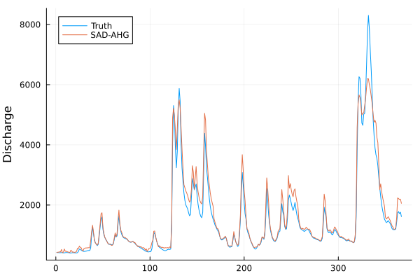
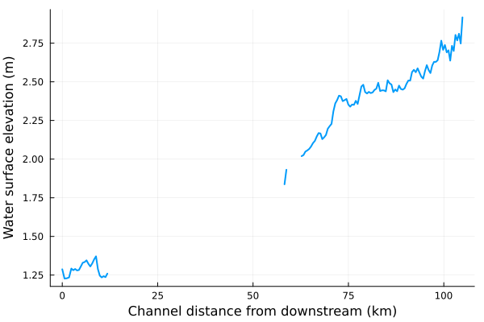
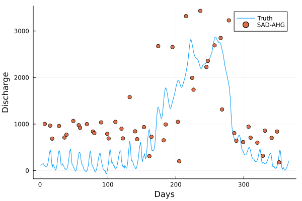

# Use cases

!!! warning "Array ordering in SAD"
`SAD` expects time series of hydraulic variable profiles as 2-D arrays, with the row dimension being the cross-sections from downstream (index 1) to upstream (last index) and the column dimension being time. The time for each column does not have to be continuous, as SAD operates on each one separately. Missing data are acceptable, but do use [Julia's missing data type](https://docs.julialang.org/en/v1/manual/missing/) instead of `NaN`. 


## Pepsi-1 experiment

We start by loading the data, including river node information and synthetic SWOT observations

```julia
using NCDatasets, Statistics, Distributions, Sad
f = Dataset("../../data/pepsi1/Po.nc")
g = NCDatasets.group(f, "XS_Timeseries")
qwbm = NCDatasets.group(f, "River_Info")["QWBM"][1]
x = (g["X"][:][end] .- g["X"][:])[end:-1:1, 1]
Q = g["Q"][:][end:-1:1, :]
H = g["H"][:][end:-1:1, :]
W = g["W"][:][end:-1:1, :]
```

Bankfull width and water surface elevation can be guessed as the maximum from the observed time series, while an initial estimate of bed slope can be obtained from the mean of surface water slope

```julia
hbf = maximum(H, dims=2)[:, 1]
wbf = maximum(W, dims=2)[:, 1]
S0 = mean(diff(H, dims=1) ./ diff(x), dims=2)[:, 1]
S0 = [S0[1]; S0]
```

Then we can derive the prior distributions using rejection sampling from uninformative priors

```julia
Qp0, np0, rp0, zp0 = Sad.priors(qwbm, minimum(H[1, :]), Sad.sinuous)
Qp, np, rp, zp = Sad.rejection_sampling(Qp0, np0, rp0, zp0, x, H, S0, mean(H[1, :]), wbf, hbf, 1000);
```

The ensemble of discharge, roughness coefficient, channel shape parameter and bed elevation can now be generated

```julia
Qe, ne, re, ze = Sad.prior_ensemble(x, Qp, np, rp, zp, 1000);
```

Bed elevation and slope are then estimated by assimilating the time-average water surface elevation profile

```julia
S = diff(H, dims=1) ./ diff(x);
Se = repeat(S', outer=3)'[:, 1:1000];
Se = [Se[1, :]'; Se]
Sad.bathymetry!(ze, Se, Qe, ne, re, x, hbf, wbf, mean(H, dims=2)[:, 1])
zp = truncated(Normal(mean(ze[1, :]), 1e-3), -Inf, minimum(H[1, :]))
Sa = mean(Se, dims=2)[:, 1]
```

and finally we assimilate the observed water surface elevation to estimate discharge and flow parameters, which include roughness coefficient and minimum cross-sectional area

```julia
Qa, na = assimilate(H, W, x, wbf, hbf, Sa, Qp, np, rp, zp, nens)
```



## Pepsi-2 experiment

The Pepsi-2 experiment added more river case studies as well as more realistic synthetic SWOT observations with partial reach coverage and observation errors. Most of the code described above for the [Pepsi-1 experiment](@ref) is contained within the `Sad.estimate` function. We start by loading the data

```julia
using NCDatasets, Statistics, Distributions, Sad
f = Dataset("../../data/pepsi2/phase3/ArialKhan.nc")
g = NCDatasets.group(f, "XS_Timeseries")
qwbm = NCDatasets.group(f, "River_Info")["QWBM"][1]
x = (g["X"][:][end] .- g["X"][:])[end:-1:1, 1]
Q = g["Q"][:][end:-1:1, :]
H = convert(Matrix{Sad.FloatM}, g["H"][:][end:-1:1, :])
W = convert(Matrix{Sad.FloatM}, g["W"][:][end:-1:1, :])
```

The `Sad.FloatM` is an alias to `Union(Missing, Float64)` type to be able to handle missing data.

```julia
H[H .== -9999.0] .= missing
W[W .== -9999.0] .= missing
```

The water surface elevations for a SWOT satellite overpass are shown in the figure below


We will get the prior distributions

```julia
Qp0, np0, rp0, zp0 = Sad.priors(qwbm, minimum(skipmissing(H[1, :])), Sad.braided)
```

and then estimate discharge and flow parameters

```julia
Qa, Qu, A0, n = Sad.estimate(x, H, W, Qp0, np0, rp0, zp0, 100, 1000)
```



## Confluence

`Confluence` is the framework that will be operationally implementing the multiple discharge estimation algorithms (SAD being one of them) for SWOT. The priors are obtained from [SWORD](https://zenodo.org/record/7410433#.Y7F7-bLMJQI)

```julia
Dataset("../../data/sword/na_apriori_rivers_v07.nc") do f
       g = NCDatasets.group(f, "nodes")
       rid = g["reach_id"][:]
       dists = g["dist_out"][:]
end

```
